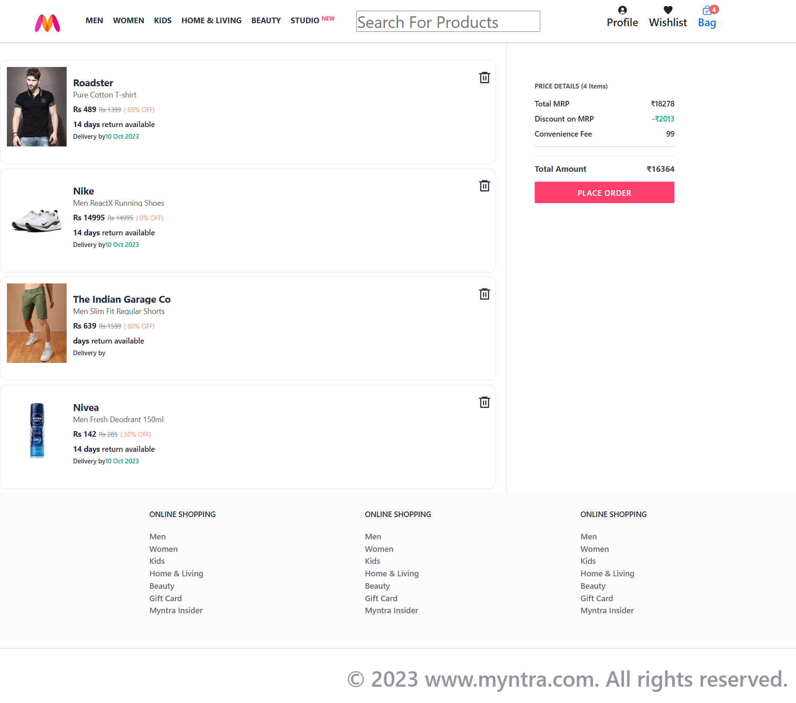

# 🛍️ Myntra Clone (React + Redux + Node.js)

A full-stack **Myntra Clone** e-commerce application built using **React, Redux, and Node.js (without Express)**.  
This project demonstrates **core e-commerce functionality** including product listing, image sliders, cart management, and dynamic price calculations (with GST and tax).

---

## 🚀 Features

✅ **Product Listing** – Served from a simple Node.js API and fetched using `fetch()` in React.  
✅ **Image Slider** – Auto and manual slider for featured products.  
✅ **Add to Cart** – Add products to the cart from the homepage.  
✅ **Remove from Cart** – Remove products from the cart page.  
✅ **Cart Page** – Displays all carted items with delete option.  
✅ **Cart Summary** – Shows total amount, GST (18%), and tax calculation dynamically.  
✅ **State Management** – Managed using **Redux Toolkit** for predictable state.

---

## 🛠️ Tech Stack

**Frontend:** React, Redux Toolkit, CSS  
**Backend:** Node.js (`http` module, no Express)  
**API Calls:** Fetch API  
**Others:** JavaScript (ES6+)

---

## 📸 Screenshots

### ✅ Home Page


### ✅ Cart Page



## ⚡ Installation & Setup

### 1️⃣ Clone Repository

```bash
git clone https://github.com/your-username/myntra-clone-react-redux-node.git
```
